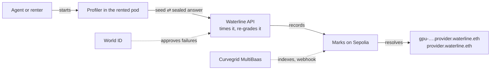

# Waterline

**Proof of Delivered Compute.** Check that the GPU you rent delivers what you pay for: the right chip, at its rated speed.

ETHGlobal Tokyo 2026 · Ethereum Sepolia · ENSv2 · World ID for Agents · Curvegrid MultiBaas

| | |
|---|---|
| **Live app** | https://waterline-eth.vercel.app |
| **Demo video** | [link] |
| **Try it on a rented GPU** | `curl -fsSL waterline-eth.vercel.app/run \| python3 - <provider> <gpu>` |
| **Contract** | `Marks` [`0x5E26AD29CBfCD7F0193d8950672f048621a604c4`](https://sepolia.etherscan.io/address/0x5E26AD29CBfCD7F0193d8950672f048621a604c4) on Sepolia, resolver for `*.waterline.eth` |

## One-sentence summary

A renter runs one command inside a rented GPU; Waterline sends a sealed INT8 exam against a deadline, re-grades a
random slice and counts the cores, then writes the verdict to that GPU's own ENS name, where a pass needs real
silicon and a failure needs a real person verified with World ID.

## Check a GPU in one line

In the rented pod's terminal, give the provider and the GPU the listing promises:

```bash
curl -fsSL waterline-eth.vercel.app/run | python3 - <provider> <gpu>
# e.g. python3 - runpod h100   ·   python3 - vastai a100   ·   python3 - lambda h200
```

- **Nothing to install or clean up.** The profiler is fetched from our API and imported from memory; nothing is
  written to the pod. It needs numpy and torch (every PyTorch image has them) and adds CuPy once if missing.
- **25 NVIDIA GPU classes:** H100 SXM, H100 PCIe, H100 NVL, H200, GH200, B200, B300, GB200, GB300, A100, L40S, L40,
  L4, A40, A10, A10G, T4, RTX 6000 Ada, RTX PRO 6000 Blackwell, RTX 5090, 4090, 3090, A6000, A5000, A4000
  (`core/gpu_classes.json`). The exam is CUDA INT8, so V100 and AMD are not covered yet.
- **63 known providers** (`core/providers.json`, from the hyperscalers to RunPod and Vast.ai) keep names
  consistent; any other name is still recorded as typed and marked "unlisted".
- **Options:** `--gpu 3` checks the fourth card of a multi-GPU pod; `--every 30m` re-checks at jittered intervals
  (a periodic series, shown as a timeline); `--times N` stops after N checks.
- **What you get:** a short receipt (verdict, the GPU's ENS name, the transaction, the report link). A pass or a
  degraded result is published at once; a failure waits for a person (below).

The web panel builds the command for you: pick the provider and GPU from the two drop-downs in the hero.

## Why

- **Compute is becoming a financial asset. Its delivery is still self-reported.** GPU cloud is heading from $25B (2025) to ~$400B
  by 2031 ([Synergy](https://www.srgresearch.com/articles/neocloud-market-forecast-to-approach-400b-by-2031-driven-by-surging-ai-infrastructure-demand)),
  banks lend against GPUs ([CoreWeave, $8.5B](https://investors.coreweave.com/news/news-details/2026/CoreWeave-Closes-Landmark-8-5-Billion-Financing-Facility-Achieving-First-Investment-Grade-Rated-GPU-backed-Financing/default.aspx)),
  and H100 rental futures are scheduled on CME from October 5 ([CME](https://investor.cmegroup.com/news-releases/news-release-details/cme-group-and-silicon-data-launch-compute-futures-october-5)).
  Buyers rely on the provider's own monitoring, periodic audits and benchmarks that are easy to game. There is no
  independent, shared record.
- **Renters mostly get less, not fake.** Throttled H100s at full price (1,755 → ~345 MHz under load:
  [matt.sh](https://matt.sh/cloud-gpu-thermal-throttling), [Spheron](https://www.spheron.network/blog/sustained-load-gpu-throttling-we-measured-the-hidden-clock-t/)),
  specs that don't match, broken NVSwitch ([Vast.ai](https://www.trustpilot.com/review/vast.ai),
  [RunPod](https://dk.trustpilot.com/review/runpod.io) reviews). Swapped chips are the extreme case: ~400,000 spoofed
  workers on one network ([io.net](https://x.com/ionet/status/1780877493672595941)). Our demo's A100-as-H100 is our own relabel.
- **Complaints don't reach the next renter.** Clouds test themselves and reviewers audit now and then
  ([SemiAnalysis](https://newsletter.semianalysis.com/p/clustermax-20-the-industry-standard)); the renter can't check
  their own rental, and the record lives on Trustpilot.

## How it works



1. **The exam.** The API issues a fresh seed and starts a clock. The GPU multiplies seeded 16,384² INT8 matrices on
   its tensor cores (8.8 trillion ops a step), commits a Merkle root of per-row fingerprints, and only then learns
   which 8 rows the API will recompute on a CPU. INT8 is exact, so the grade is bit for bit.
2. **The chip.** A timing staircase counts the cores (132 H100 SXM, 114 H100 PCIe, 108 A100, …), FP8 and memory
   bandwidth are timed. Heat slows a chip; it can't remove cores.
3. **Three verdicts.** Wrong chip or wrong answers: **fail**. The right chip, too slow: **degraded**, published with
   its numbers and never counted toward failed. On time: **pass**.
4. **The record.** `Marks` stores the verdict under the GPU's ENS name and rolls it up to the provider's name.

## Four pillars

| Pillar | Question | Carried by |
|---|---|---|
| **Proof** | Is this GPU what was sold? | The profiler and the API's exam |
| **Place** | Where is the result kept? | ENSv2 |
| **People** | Who can report a failure? | World ID for Agents |
| **Use** | How do agents act on it? | Curvegrid MultiBaas |

### Proof: the profiler
- **Secret INT8 exam, sealed then spot-checked**, against a deadline scaled to the claimed GPU's rated INT8 speed.
- **Heat-proof chip check:** cores from a timing staircase, FP8, bandwidth; 37 reference GPUs tell look-alikes apart.
  When two chips can't be told apart (an H100 SXM and an H100 NVL), the claim stands; an H100 sold as an H200 fails
  on bandwidth.
- **Performance:** verified INT8 throughput from the re-graded work against the rating, the reference table and other
  checks of the same model (`docs/METRICS.md`). The machine's own health report (NVML, DCGM) is advisory.
- **GPU names from the card:** `gpu-` + the first 8 hex digits of the NVIDIA UUID (`GPU-6f3c2a1b-…` →
  `gpu-6f3c2a1b`), the digits `nvidia-smi -L` prints. The full UUID and a per-core timing fingerprint are kept with
  each check; a fingerprint change is shown, never judged.

### Place: ENSv2
- **Wildcard resolution, three levels.** `Marks` is the ENSIP-10 resolver for `waterline.eth`: every
  `<provider>.waterline.eth`, `gpu-<id>.<provider>.waterline.eth` and each check, `<n>.gpu-<id>.<provider>.waterline.eth`,
  resolves with no registration. A check's name answers `waterline.verdict`, `class`, `cores`, `tops`, `pct_of_spec`,
  `at` and its own `report` hash; the GPU answers `waterline.checks` (how many). Text records: `waterline.status`, `class`, `cores`,
  `pct_of_spec`, `passes`, `degraded`, `fails`, `humans`, `recoveries`, `fingerprint`, `report`; providers add `gpus`,
  `failed_gpus`, `note`.
- **The tree is the roll-up.** A GPU's node derives from its provider's, so every report also scores the provider
  (GPUs checked, failed now, degraded, people who reported, each once). Renaming a chip hides nothing. Two passes
  after a failure mark a GPU `recovered`.
- **Enhanced Access Control.** Only the REPORTER role writes scores (our API today; grantable per GPU or per provider).
  A provider's NOTE role edits only `waterline.note`, never a score. Class names are an admin-set table, so new GPUs
  need no redeploy.
- **Evidence anchored.** `waterline.report` is the keccak256 of the full report: download it, hash it, compare. The
  panel opens any check from that hash (`/#/r/<hash>`).

### People: World ID for Agents
- **One person, one voice.** Login and approvals use World's device-code flow against `sandbox.auth.world.org`; the
  id_token is verified in our backend (RS256, issuer, audience, `auth_time` under 120 s). From the pairwise `sub` we
  derive two private voter ids (HMAC): one per GPU, one per provider. One person counts once per GPU and once per
  provider; two different people mark a GPU failed.
- **Failures need a person, passes don't.** A failure is published only after a fresh World approval; the person who
  approves is the reporter; deny or expiry publishes nothing.
- **One person, many agents: the mandate.** One fresh approval grants a mandate (1 hour to 3 days, 5 to 100 reports,
  revocable). The person's agents then report failures at once, each still that person's one voice. The panel's
  **World ID** page and header show the session and the mandate (used, left, expiry); every report made under it says
  so. `python -m agent allow --hours 24 --max 20`.
- **Accusations cost something.** The reporter pastes the listing they rented and accepts that the report is tied to
  their World ID. **Jev (TypeSafe) reads that listing**: if it reads as another GPU, the report stops unless the person
  insists, and a mandate never overrides it. The panel shows the listing, Jev's reading and the pseudonymous reporter.

### Use: Curvegrid MultiBaas
- **History decides, not an LLM.** Event queries by GPU and by provider make the agent skip suspect, failed and
  degraded GPUs and prefer providers with fewer failures. On a fail, the agent stops paying.
- **Writes without handing over a key.** MultiBaas builds each transaction, we check and sign it, MultiBaas submits
  it, indexes the event and calls our webhook.

## The renter agent

```bash
export WATERLINE_API=https://waterline-eth.vercel.app
python -m agent login                                   # once, with World App
python -m agent allow --hours 24 --max 20             # optional: let your agents report failures
python -m agent check --pod ssh://root@host:port --cloud vastai --listing "1x H100 80GB SXM5"
python -m agent check ... --every 30m --times 6         # a periodic series
python -m agent check ... --web                         # leave any approval to the web panel
python -m agent choose --listings listings.json         # pick a GPU from MultiBaas history only
```
On a failure it stops the rental (`--stop-cmd`, e.g. `runpodctl stop pod {pod_id}`), then reports under the mandate,
asks for your World approval, or points you to the web panel.

## The control panel

https://waterline-eth.vercel.app: **Overview** (the one-line check, how it works, recent checks), **GPUs** (the ENS
name tree, every GPU on record), **Checks** (each check: the exam, the core staircase, performance against the rating
and other checks, health, the evidence and its onchain hash, approval), **Providers** (roll-up per provider, then by
model), **World ID** (your session and mandate). Every GPU and provider name has its own page, read live from ENS.

## Deployed

| | |
|---|---|
| `Marks` (resolver + record) | [`0x5E26AD29CBfCD7F0193d8950672f048621a604c4`](https://sepolia.etherscan.io/address/0x5E26AD29CBfCD7F0193d8950672f048621a604c4) |
| ENS name | `waterline.eth` on ENSv2 (Sepolia), resolver = Marks |
| Reporter (API) | [`0xA0B0dCe3c40499f7554c1835766B555D73A15C10`](https://sepolia.etherscan.io/address/0xA0B0dCe3c40499f7554c1835766B555D73A15C10) |
| MultiBaas | contract alias `marks4`, webhook to `/api/webhooks/multibaas` |
| API + panel | Vercel (FastAPI) + Redis |

`scripts/check_live.py` checks the whole stack (RPC, roles, ENS resolution, MultiBaas link and webhook, API, World).

## Principles and limits

- **Evidence decides.** Passes carry evidence; failures need verified people; the machine's own numbers only inform.
- **Two layers.** The exam guards the measurement (secret seed, sealed answers, API-chosen rows, heat-proof chip
  check). World, two people and per-provider dedup guard the verdict: gaming can't be amplified, and it's attributable.
- **No provider cooperation.** The host never writes a score.
- **Limits.** A host could answer checks on a real H100 and run your job on an A100 (checks at random moments raise
  the cost; attestation would close it). A modified profiler could report fewer cores (two people, the roll-up and
  later passes bound it). The GPU UUID and the provider name are what the host's driver and the renter report. People
  can be bribed. World runs on its sandbox (proofs mocked by World) and is verified in our backend.

## What's next

- Checks at API-chosen moments inside the job, several per rental: a distribution, not a point.
- Every renter's container a verifier: the REPORTER role granted per GPU, per provider or for all.
- A site level in the name tree (`gpu-….tyo1.vastai.waterline.eth`), where throttling clusters.
- The listing bound into the evidence, and the provider proven from the network the pod runs on.
- AMD Instinct and V100 (a non-INT8 exam path).

## Repo

| Folder | What |
|---|---|
| `core/` | Challenge maths (seeded INT8 generator, row fingerprints, Merkle root, frozen vectors), GPU classes, reference specs, known providers, listing reader |
| `contracts/` | `Marks`: record, ENS wildcard resolver, ENSv2 Enhanced Access Control (Foundry); ENSv2 pinned at `sepolia-deployment-2026-09-15` |
| `api/` | Waterline API (FastAPI on Vercel + Redis): the exam, grading, World login/approval/mandate, chain writes, MultiBaas reads and webhook, the one-liner |
| `prover/` | Profiler that runs in the rented pod (CuPy + torch): exam, probes, performance, health |
| `agent/` | Renter CLI: check a pod over SSH, stop paying, report, mandate, choose GPUs from history |
| `web/` | Control panel served by the API |
| `scripts/` | Deploy helpers, MultiBaas link, live checks, World probe |
| `tests/` | API, profiler and agent tests (169) |
| `docs/` | `INTERFACES.md` (the spec), `METRICS.md`, GPU reference, build prompts |

## Setup and testing

```bash
python3 -m venv .venv && .venv/bin/pip install -r requirements.txt
.venv/bin/python -m core.verify_vectors                 # frozen vectors
.venv/bin/python -m pytest -q tests                     # API, profiler, agent
(cd contracts && forge test --no-match-contract EnsFork) # contract
(cd contracts && forge test --match-contract EnsFork --fork-url $SEPOLIA_RPC)  # real ENSv2 on a Sepolia fork
.venv/bin/python scripts/check_live.py                  # the deployed stack

# local end to end (simulated World, CPU profiler)
WORLD_MOCK=1 ALLOW_CLIENT_SIZES=1 AGENT_TOKEN_SECRET=dev VOTER_SECRET=dev .venv/bin/uvicorn api.app:app --port 8787
.venv/bin/python -m prover.run --api http://127.0.0.1:8787 --cloud runpod --claimed 1 --cpu
.venv/bin/python -m prover.run --api http://127.0.0.1:8787 --cloud vastai --claimed 1 --cpu --sms 108   # an A100 sold as H100
open http://127.0.0.1:8787
```
On a real GPU pod: `prover/POD_SETUP.md`. Deploying the contract: `contracts/README.md`. Environment: `.env.example`.

## How we used ENSv2

- `Marks` is registered as the resolver of `waterline.eth` on the ENSv2 Sepolia deployment and answers every name
  below it (ENSIP-10 wildcard), so a GPU gets an ENS name the moment it is first checked, without a registration.
- The name tree is the data model: `node = keccak(providerNode, gpuLabel)`, derived in the contract, so a GPU can only
  roll up into its real provider.
- ENSv2 Enhanced Access Control splits who may write what: REPORTER (scores), NOTE (a provider's own words),
  class-name admin; roles can be granted per name.
- Anyone reads the record with any ENS client through the Universal Resolver; the panel's name pages and lookup do
  exactly that, live from Sepolia.

## How we used MultiBaas

- **Writes:** the API composes every `Marks.record` call through MultiBaas (nonce and gas filled in), checks the
  calldata, signs it locally, and submits it through MultiBaas. (MultiBaas's concurrent nonce management needs its
  hosted wallets; our reporter signs locally, so we publish one report at a time.)
- **Indexer:** event queries on `Marks.Reported` grouped by GPU, and on `ProviderTally` grouped by provider, power the
  agent's choice and the panel's GPU list, name tree and Providers page. `Marks` emits running totals so queries only
  need `last`/`max`.
- **Listener:** a signed webhook on `Reported` confirms each report was indexed; the panel shows "Indexed ✓".

## Our experience with MultiBaas

[DRAFT from build notes: rewrite in your own words before submitting.]
- **Wins:** compose-then-sign kept the reporter key on our side while MultiBaas handled nonce and gas; the webhook
  gave us "indexed" confirmation for free; event queries grouped by GPU and by provider replaced a backend database.
- **Challenges:** the free plan's 100-block look-back means you must link a contract right after deploying it, or
  history is lost. Re-deploying a contract version hit a 409 on the existing address alias; we linked it under a new
  alias (`marks4`). Event queries have no count or count-distinct aggregator, so the contract emits running totals.
- **A surprise:** event queries returned `bytes32` fields as lists of byte values (`"[253, 55, …]"`) instead
  of hex after a new contract version, while the webhook still sent hex; we now decode both.
- **Feedback:** the MCP server proof of concept can't select `triggered_at` or `contract_address_alias`, which limits
  agent use; the Python SDK lags the current API paths, so we called REST directly.

## World ID integration debrief

[DRAFT from build notes: rewrite in your own words, and fill in the time, before submitting.]

### Time to first success
[N] hours from first attempt to the first live device-code login through `sandbox.auth.world.org` from our
production API. Most of it went to finding the right portal; the code itself worked the first time it had a
valid client.

### Friction encountered
We first registered an app at developer.world.org. Its id returned `invalid_client` at the World ID for Agents
IdP with no hint that it belonged to a different product, so we rebuilt the approval on IDKit before the prize page
pointed us to `sandbox.auth.world.org/portal`. The portal calls OIDC clients "apps", which made the right button
hard to find. The sandbox app's TestFlight enrollment stayed pending; the note that proofs are mocked lived only on
the prize page.

### Missing capability or documentation
docs.world.org doesn't link to the Agents IdP or its portal, and the device-grant guide is only reachable through
the IdP's MCP resources. It isn't documented whether the World ID Simulator works with the sandbox IdP.

### What worked well
The pairwise `sub` is stable: two device logins from the same World App gave the same `sub` (checked with
`scripts/world_sub_probe.py`, which prints only hashes). That made one-person-one-voice and the mandate simple.

### The one improvement with the greatest impact
Make `invalid_client` say which environment and portal a client id belongs to (or link both portals from each other).
That one message would have saved us the IDKit detour.

## How we built it

Architecture, design decisions and product direction by the builder: the provider-independent design, the
evidence-vs-human rule for passes and failures, per-GPU ENS names with only the contract able to write the verdict,
World ID Human Continuity for one-person-one-voice, the health report, and the five-piece system. Implementation was
assisted by Claude Code, working from our specs (`PLAN.md`, `docs/INTERFACES.md`); the prompts are in `docs/prompts/`.
All code was written during the event.

## Team

[name] · [X handle] · [GitHub handle] · solo builder

## Builds on

Unprivileged Topology Certificates (arXiv 2606.24934) and DrawnApart for GPU fingerprinting; standard GPU tooling
(NVML, DCGM, gpu-fryer-style burns) for the health report. What's new is combining them into a renter-run check
whose passes carry evidence and whose failures need verified humans, recorded onchain where no host can write.

Brand marks: ENS, World and Curvegrid logos in `web/logos/` are their owners' and are shown only to credit the
technologies this project is built on.
